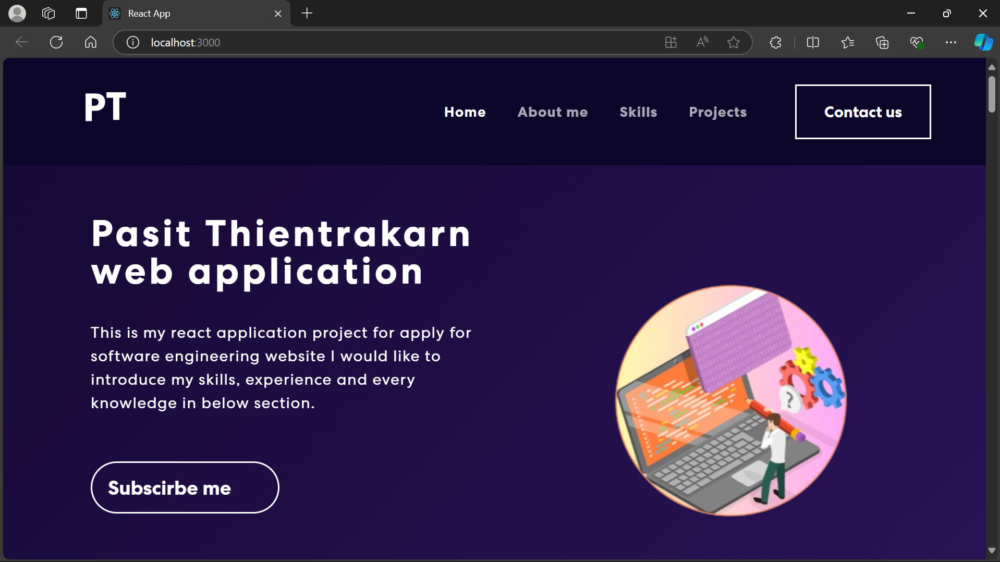

# Pasit-Single-Website
**Pasit-Single-Website** is a single page website for my personal data which developed based on **React Framework** and **Express Framework** using **Javascript language** with *Create React App* environment, HTML and CSS to optimize contents.


## Overview
In the project of a single page website contain multiple components that introduce my personal profile information such as skills, projects, content and etc and the project also provide question form and subscription form and notification script for user that filled form via email and retrive question form data with *Sqlite3* database.



**Pasit-Single-Website** is created by **React Framework** which working with **Express Framework** contain backend-script and frontend-script inside isolated directory named `ui` and `api`. 

- Utilzing **JSX Format** in each component to determine webpage format and contents.

- Using `App.css` inside `./ui/src/` directory for styling webpage.

## Important Directories
- `ui` used for store React scripts that display every components in website. In `ui` section it contain seperated multiple components which display every section of website.

- `api` directory used for store **Express** server side script to handling every requests that is provided. `api`

- `database` directory used for contain `email_data.db` file which storing email status data and total email in each day.

## API
The website contain 2 forms which named `QuestionForm` and `MailchimpForm`. When forms is filled script in ui section will sent requests to server which `server.js` has been executed to handling requests to post result of form filled to user email.

### `QuestionForm` Diagram
- `QuestionForm` will retrive users form data and send email to user if form data is correct then **express server** will update new email status data to **email_send_records** table. Moreover, **express server** will also update **total_emails** table for total emails that have been send today.

### `MailchimpForm` Diagram
- `MailchimpForm` provided **Mailchimp Form** that contain form to retrive users subscription and store subscription to **Mailchimp** server that inside **Mailchimp** website. When subscription is provided successfully React ui script will sent request to
Express server. After that Express server will sent user notification when subcscription is success. 

- `Mailchimp` is a platform website that allow you to provide subscription server to retrive users subscription data. First, log in and create some solution to retrive subscription data.

## Initial Setup
## Usage

In the project directory, you can run:

## `npm start`

Runs the app in the development mode.\
Open [http://localhost:3000](http://localhost:3000) to view it in your browser.

The page will reload when you make changes.\
You may also see any lint errors in the console.

`npm start` also execute command that you've define in `package.json`

For example if in `package.json` "scripts" is:

```
"scripts": {
    "start": "cd ./ui/ && react-script start"
}
```

Which means you are going to `ui` directory and execute `react-script start`

## `react-script start` 
`react-script start` will find `package.json` file for initial configuration and find 
`main` file that will be executed.

## `npm test`

Launches the test runner in the interactive watch mode.\
See the section about [running tests](https://facebook.github.io/create-react-app/docs/running-tests) for more information.

## `npm run build`

Builds the app for production to the `build` folder.\
It correctly bundles React in production mode and optimizes the build for the best performance.

The build is minified and the filenames include the hashes.\
Your app is ready to be deployed!

See the section about [deployment](https://facebook.github.io/create-react-app/docs/deployment) for more information.

## `npm run eject`

**Note: this is a one-way operation. Once you `eject`, you can't go back!**

If you aren't satisfied with the build tool and configuration choices, you can `eject` at any time. This command will remove the single build dependency from your project.

Instead, it will copy all the configuration files and the transitive dependencies (webpack, Babel, ESLint, etc) right into your project so you have full control over them. All of the commands except `eject` will still work, but they will point to the copied scripts so you can tweak them. At this point you're on your own.

You don't have to ever use `eject`. The curated feature set is suitable for small and middle deployments, and you shouldn't feel obligated to use this feature. However we understand that this tool wouldn't be useful if you couldn't customize it when you are ready for it.
