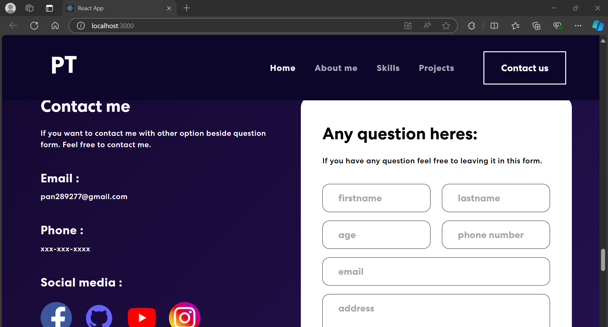
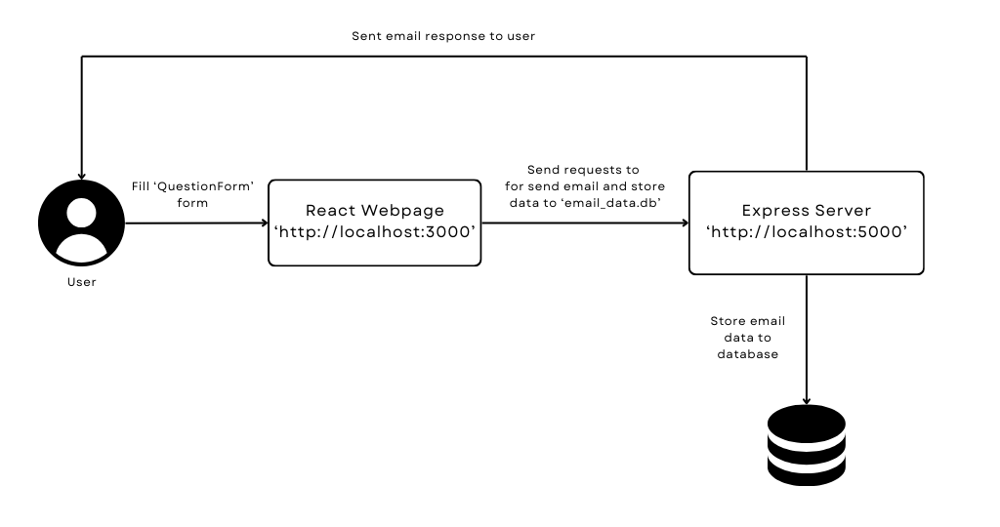
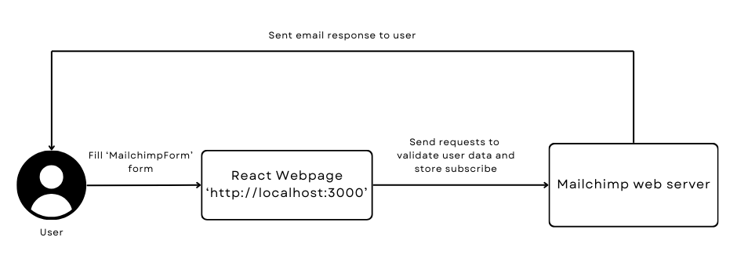

# Pasit-Single-Website
**Pasit-Single-Website** is a single-page website developed using **React Framework** for the frontend and **Express Framework** for the backend, utilizing **Javascript** in *Create React App* environment. The website utilize HTML and CSS to optimize contents presentation.

## Overview
This project features multiple components section that introduce my personal profile including skills, projects and more. Moreover, it provides my contact information and my GitHub account link.

The website includes a question form and subscription form that allow users to submit inquires and subscribe to my website response is sent to user via email. Form is executed and data being fetched to backend server to retrieve user data.


## Important Directories and Files
- `ui` directory used for store **React Website** script, including all components located in `./ui/src/components`.

- `api` directory used for houses **Express** server-side script to handling incoming requests. 

- `database` directory used for contains `email_data.db` file, which stores email status data.

- `App.css` file located in `./ui/src/` for styling webpage.

## Database
The project utilizes *Sqlite3* as *Database Management System (DBMS)*, which is flexible to store and retrive data.

Inside `email_data.db` contains 2 tables.

- `email_send_records` used for store each email sent data.

- `total_emails` used for counts the total emails sent each day.

## API Forms
The website include 2 forms named `QuestionForm` and `MailchimpForm` that allowing user to submit the form data.

## `QuestionForm`



Upon user filling out the `QuestionForm`,  response will be sent to user by sending email response. Addtionally, the data of user's input is sent to **Express Server**, which retrive data and stores it to `email_data.db`.



## `MailchimpForm`
**Mailchimp** is a marketing platform that facilitates interaction, subscription and communications with clients.

`MailchimpForm` provided subscription form that allow users to subscribe the project webpage. When users submit form data, The React Website sends a request to **Mailchimp website server** of registered account in **Mailchimp** to validate and store subscriber data in website.




## Usage
### Initial Setup
Before executing React webpage, a few setup are required.

1. In `./package.json` ensure that `start`, `build`, `test` and `eject` are set as follows.
    ```JSON
    {
        "scripts": {
            "start": "cd ./ui/ && react-scripts start",
            "build": "cd ./ui/ && react-scripts build",
            "test": "cd ./ui/ && react-scripts test",
            "eject": "cd ./ui/ && react-scripts eject"
        }
    }
    ```

2. In the `ui` directory ensure that you have created another `package.json` file which used to execute `index.js` file and ensure that `main` is added.
    ```JSON
    {
        "main": "index.js",
    }
    ```

3. In the `api` create another `package.json` and set `type` to `module`.
    ```JSON
    {
        "type": "module",
    }
    ```
4. Create `.env` file in the `ui` directory for environment varaiable. Inside the file must contain `REACT_APP_ADMIN_EMAIL`, `REACT_APP_ADMIN_GITHUB` and  which users must given a value.

5. Register to **Mailchimp** and create sign -up form. Afterward, populate the `.env` file with `REACT_APP_MAILCHIMP_U`, `REACT_APP_MAILCHIMP_URL` and `REACT_APP_MAILCHIMP_ID` These values acquired from *Sign up form url* .

6. Install required packages as follow
    - react-bootstrap
    - react-on-screen
    - react-multi-carousel
    - react-mailchimp-subscribe
    - animate.css
    - express
    - nodemailer
    - cors
    - sqlite3

    By using `npm install` command as example below.
    ```Bash
    npm install react-bootstrap
    ```

## Execution of the Webpage
To ensure email responses for all forms, user must execute both **React Webpage** and **Express Server** simultaneously.

### Execute React Webpage.
Ensure our terminal is in project parent directory.

Runs the app in the development mode by `npm start`.

```bash
npm start
```
This command will open [http://localhost:3000](http://localhost:3000) to view it in your browser.

### Execute Express Server.
Open another terminal and execute another script to handle income requests from the **React Webpage** by executing `server.js` file.

```bash
cd api
node server.js
```
This command will open [http://localhost:5000](http://localhost:5000) to view it in your browser.